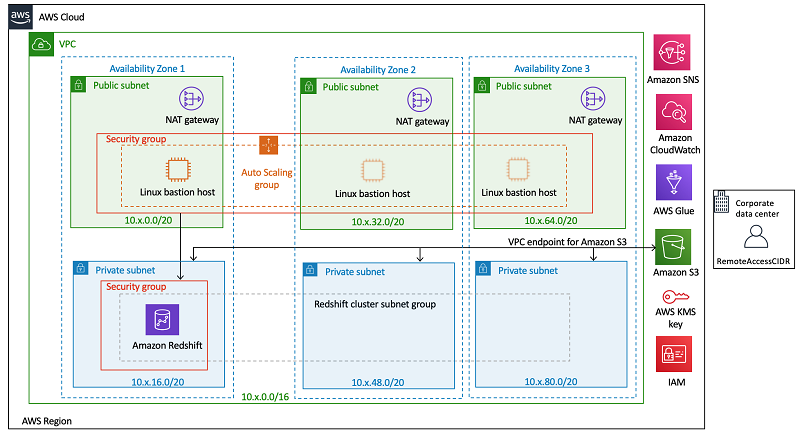

## overview
この投稿では、AWS アカウントで Amazon Redshift クラスターのデプロイを自動化する方法について説明します。セキュリティと高可用性に関する AWS のベストプラクティスに基づいてクラスターの設定を促進することで、AWS CloudFormation を使った設定を速やかに行うことができるようになります。 必要に応じてカスタマイズできる CloudFormation の一連のサンプルテンプレートを見ていきます。

Amazon Redshift は、高速かつスケーラブルで完全マネージド型の ACID と ANSI SQL に準拠したクラウドデータウェアハウスサービスです。新しいデータウェアハウスの設定とデプロイをほんの数分で行い、Amazon Redshift に保存されているペタバイト規模の構造化データに対してもクエリを実行できます。Amazon Redshift Spectrum を使用すると、データウェアハウジング機能が Amazon S3 に構築したデータレイクに拡張されます。Redshift Spectrum では、データをロードすることなく、エクサバイトの構造化および半構造化データをネイティブ形式でクエリできます。Amazon Redshift は、機械学習、巨大な並列クエリ実行、高性能ディスクのカラムナストレージを使用することで、他のデータウェアハウスデータベースよりも高速なパフォーマンスを実現します。Amazon Redshift を設定すれば、数分でスケールの拡大縮小が行えるだけでなく、コンピューティング能力を自動的に拡張して、無制限の同時実行を確実に行うことができます。

## CloudFormation テンプレートを使用する利点
AWS CloudFormation テンプレートを使用すれば、何百にもおよぶ手動での手順を、テキストファイルにある少しの手順にまとめることが可能です。ファイル内の宣言コードは、作成するリソースの意図した状態をキャプチャし、数百の AWS リソースの作成を自動化します。このテンプレートは、インフラストラクチャの信頼できる唯一の情報源となります。

CloudFormation テンプレートはアクセラレーターとして機能します。このテンプレートで、複数のリージョンと複数のアカウントにまたがり、最小限の労力と時間で、安全で繰り返し可能な方法でテクノロジーとインフラストラクチャのデプロイを自動化できるようになります。

## アーキテクチャの概要
次のアーキテクチャ図と概要は、この投稿で使用するソリューションを解説しています。
 <!-- {.img-fluid} -->

## solution
これらの CloudFormation テンプレートで構築したアーキテクチャは、高可用性とセキュリティのための AWS のベストプラクティスをサポートしています。

VPC の CloudFormation テンプレートは、以下をサポートしています。

1. 高可用性と災害対策のために 3 つのアベイラビリティーゾーンを設定します。自然災害が発生した場合に最適な分離と安定性を得られるよう、リージョン内のゾーンを地理的に分散します。
1. 各ゾーンに 1 つのパブリックサブネットと 1 つのプライベートサブネットをプロビジョニングします。データ漏洩のリスクを軽減するため、外部と接するリソースにはパブリックサブネットを、内部リソースにはプライベートサブネットを使用することをお勧めします。

## summary
この投稿では、Amazon Redshift クラスターの作成を自動化する方法をご紹介しました。また、AWS CloudFormation を使用した AWS セキュリティと高可用性のベストプラクティスに基づく AWS インフラストラクチャが必要であることも説明しました。サンプルの CloudFormation テンプレートをお客様のビジネスニーズに合わせて変更し、せひ活用してください。

このブログ記事にご意見や質問がある場合は、コメント欄をご利用ください。


### Custom COntainers
::: tip
This is a tip
:::

::: warning
This is a warning
:::

::: danger
This is a dangerous warning
:::

::: danger STOP
Danger zone, do not proceed
:::

```js{2,4,8,16,32,64,65}
'use strict'

/**
 * Module dependencies.
 */

const Config = require('markdown-it-chain')
const highlight = require('./lib/highlight')
const { PLUGINS, REQUIRED_PLUGINS } = require('./lib/constant')
const highlightLinesPlugin = require('./lib/highlightLines')
const preWrapperPlugin = require('./lib/preWrapper')
const lineNumbersPlugin = require('./lib/lineNumbers')
const componentPlugin = require('./lib/component')
const hoistScriptStylePlugin = require('./lib/hoist')
const convertRouterLinkPlugin = require('./lib/link')
const snippetPlugin = require('./lib/snippet')
const emojiPlugin = require('markdown-it-emoji')
const anchorPlugin = require('markdown-it-anchor')
const tocPlugin = require('markdown-it-table-of-contents')
const {
  slugify: _slugify,
  parseHeaders,
  logger, chalk, normalizeConfig,
  moduleResolver: { getMarkdownItResolver }
} = require('@vuepress/shared-utils')

/**
 * Create markdown by config.
 */

module.exports = (markdown = {}) => {
  const {
    externalLinks,
    anchor,
    toc,
    plugins,
    lineNumbers,
    beforeInstantiate,
    afterInstantiate
  } = markdown

  const resolver = getMarkdownItResolver()

  // allow user config slugify
  const slugify = markdown.slugify || _slugify

  // using chainedAPI
  const config = new Config()

  config
    .options
      .html(true)
      .highlight(highlight)
      .end()

    .plugin(PLUGINS.COMPONENT)
      .use(componentPlugin)
      .end()

    .plugin(PLUGINS.HIGHLIGHT_LINES)
      .use(highlightLinesPlugin)
      .end()

    .plugin(PLUGINS.PRE_WRAPPER)
      .use(preWrapperPlugin)
      .end()

    .plugin(PLUGINS.SNIPPET)
      .use(snippetPlugin)
      .end()

    .plugin(PLUGINS.CONVERT_ROUTER_LINK)
      .use(convertRouterLinkPlugin, [Object.assign({
        target: '_blank',
        rel: 'noopener noreferrer'
      }, externalLinks)])
      .end()

    .plugin(PLUGINS.HOIST_SCRIPT_STYLE)
      .use(hoistScriptStylePlugin)
      .end()

    .plugin(PLUGINS.EMOJI)
      .use(emojiPlugin)
      .end()

    .plugin(PLUGINS.ANCHOR)
      .use(anchorPlugin, [Object.assign({
        slugify,
        permalink: true,
        permalinkBefore: true,
        permalinkSymbol: '#'
      }, anchor)])
      .end()

    .plugin(PLUGINS.TOC)
      .use(tocPlugin, [Object.assign({
        slugify,
        includeLevel: [2, 3],
        format: parseHeaders
      }, toc)])
      .end()

  if (lineNumbers) {
    config
      .plugin(PLUGINS.LINE_NUMBERS)
        .use(lineNumbersPlugin)
  }

  beforeInstantiate && beforeInstantiate(config)

  const md = config.toMd(require('markdown-it'), markdown)

  const pluginsConfig = normalizeConfig(plugins || [])
  pluginsConfig.forEach(([pluginRaw, pluginOptions]) => {
    const plugin = resolver.resolve(pluginRaw)
    if (plugin.entry) {
      md.use(plugin.entry, pluginOptions)
    } else {
      // TODO: error handling
    }
  })

  afterInstantiate && afterInstantiate(md)

  module.exports.dataReturnable(md)

  // expose slugify
  md.slugify = slugify

  return md
}

module.exports.dataReturnable = function dataReturnable (md) {
  // override render to allow custom plugins return data
  const render = md.render
  md.render = (...args) => {
    md.$data = {}
    md.$data.__data_block = {}
    md.$dataBlock = md.$data.__data_block
    const html = render.call(md, ...args)
    return {
      html,
      data: md.$data,
      dataBlockString: toDataBlockString(md.$dataBlock)
    }
  }
}

function toDataBlockString (ob) {
  if (Object.keys(ob).length === 0) {
    return ''
  }
  return `<data>${JSON.stringify(ob)}</data>`
}

function isRequiredPlugin (plugin) {
  return REQUIRED_PLUGINS.includes(plugin)
}

function removePlugin (config, plugin) {
  logger.debug(`Built-in markdown-it plugin ${chalk.green(plugin)} was removed.`)
  config.plugins.delete(plugin)
}

function removeAllBuiltInPlugins (config) {
  Object.keys(PLUGINS).forEach(key => {
    if (!isRequiredPlugin(PLUGINS[key])) {
      removePlugin(config, PLUGINS[key])
    }
  })
}

module.exports.isRequiredPlugin = isRequiredPlugin
module.exports.removePlugin = removePlugin
module.exports.removeAllBuiltInPlugins = removeAllBuiltInPlugins
module.exports.PLUGINS = PLUGINS
```

> ウィキペディア（英: Wikipedia）は、ウィキメディア財団が運営しているインターネット百科事典。コピーレフトなライセンスのもと、サイトにアクセス可能な誰もが無料で自由に編集に参加できる。世界の各言語で展開されている。
> [Wikipediaより](https://ja.wikipedia.org/wiki/%E3%82%A6%E3%82%A3%E3%82%AD%E3%83%9A%E3%83%87%E3%82%A3%E3%82%A2 "by Wikipedia")
